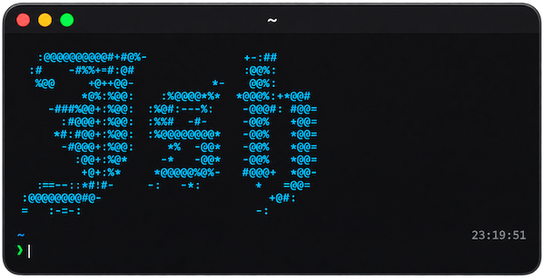
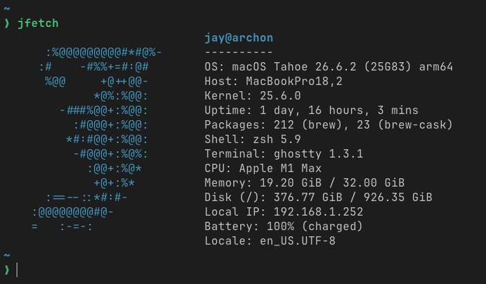
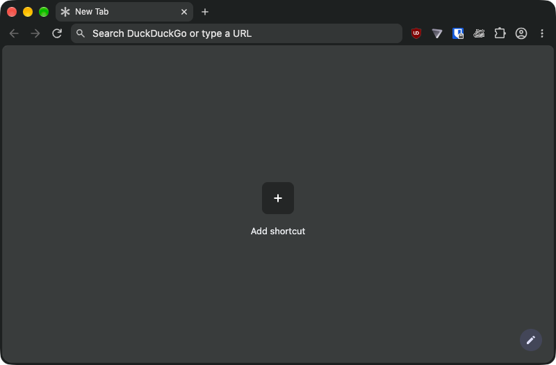

<div align="center">
  

  <p><strong>An opinionated shell environment, set of tools and configuration </br> automations for my macOS, Linux, and Windows workstations.</strong></p>
</div>

```sh
curl -fsSL https://raw.githubusercontent.com/jovalle/jsh/main/j.sh | bash
```

| 💚 Bare (default)            | 💙 Slim               | 💜 Full              |
| :--------------------------- | :-------------------- | :------------------- |
| `jsh runtime`                | `jsh install`         | `jsh setup`          |
| Try before you buy\*         | ✓ Everything in Bare  | ✓ Everything in Slim |
| ✓ Isolated shell             | ✓ Persistent launcher | ✓ Package installs   |
| ✓ Curated and dynamic prompt | ✓ Essential tools     | ✓ OS configuration   |
|                              | ✓ Managed dotfiles    | ✓ Application tweaks |

Pass the command straight to the bootstrap to skip ahead, and add `--yes` to accept that level's prompts:

```sh
curl -fsSL https://raw.githubusercontent.com/jovalle/jsh/main/j.sh | bash -s -- setup
```

Stay current with `jsh update`, preview it with `--dry-run`, and use `jsh doctor` or `jsh repair` when something drifts.

**\* Forever free**

## Enhancements

All scripts and tools residing in [`bin/`](bin/) are globally executable via `PATH`.

### Commands

Everyday commands, rebuilt the way I wish they worked.

| Command                      | What it adds                                                                                |
| ---------------------------- | ------------------------------------------------------------------------------------------- |
| [`jadopt`](bin/jadopt)       | Moves any file in your home directory into the managed dotfiles.                            |
| [`jbrew`](bin/jbrew)         | Homebrew with macOS and Linux availability in search, `whatprovides`, and adoption.         |
| [`jfetch`](bin/jfetch)       | A fastfetch-inspired system summary.<br> |
| [`jgit`](bin/jgit)           | Per-repo identities, timestamped commits, history rewrites, and gist-backed stashes.        |
| [`jgraphify`](bin/jgraphify) | Converts data into graph representations for visualization and analysis.                    |
| [`jmount`](bin/jmount)       | SMB and NFS mounts from a URL or a saved profile.                                           |
| [`jsh`](bin/jsh)             | The Jsh launcher: runtime, install, setup, update, doctor, and repair.                      |
| [`jssh`](bin/jssh)           | SSH that brings a portable Jsh environment to the remote host.                              |
| [`jstow`](bin/jstow)         | GNU Stow, reimplemented in Bash, for deploying dotfile links.                               |
| [`jventoy`](bin/jventoy)     | Initializes Ventoy drives and keeps their ISOs up to date.                                  |
| [`jvim`](bin/jvim)           | Neovim with self-contained data and cache, falling back to Vim or Vi.                       |

### Utilities

| Command                      | What it adds                                                                |
| ---------------------------- | --------------------------------------------------------------------------- |
| [`cafe`](bin/cafe)           | Keeps the screen awake on macOS, Linux, and Windows until you press Ctrl+C. |
| [`colours`](bin/colours)     | Prints the 256-colour palette, each number in its own colour.               |
| [`httpstat`](bin/httpstat)   | curl with a timing breakdown for DNS, connect, TLS, and transfer.           |
| [`kubecolor`](bin/kubecolor) | Colorized interactive `kubectl` output.                                     |
| [`kubectx`](bin/kubectx)     | Switches between `kubectl` contexts.                                        |
| [`kubens`](bin/kubens)       | Switches between Kubernetes namespaces.                                     |
| [`nukem`](bin/nukem)         | Removes finalizers from a namespace stuck terminating.                      |
| [`proxy`](bin/proxy)         | Runs a command with HTTP and HTTPS proxy variables set.                     |
| [`spotifix`](bin/spotifix)   | Configures quick play controls and enhancements for Spotify.                |
| [`sublime`](bin/sublime)     | Opens Sublime Text and manages its patch status.                            |

### Apps

With `jsh setup`, popular apps are configured the way I like them.

#### Waterfox


My daily driver. Powered by Betterfox, a slew of add-ons, a few custom tweaks, and personalized settings.

[`waterfix`](bin/waterfix) manages it all including add-ons, placement, and layout. It also tidies bookmarks, and loads favicons to address the emptiness of a fresh install.

#### Helium



Contingency to [Waterfox](#waterfox) in a growing world of Chromium. Hardened profile with Bitwarden, Proton VPN, and Privacy Badger alongside the built-in uBlock Origin.

Launch and verify it with [`helium`](bin/helium).
