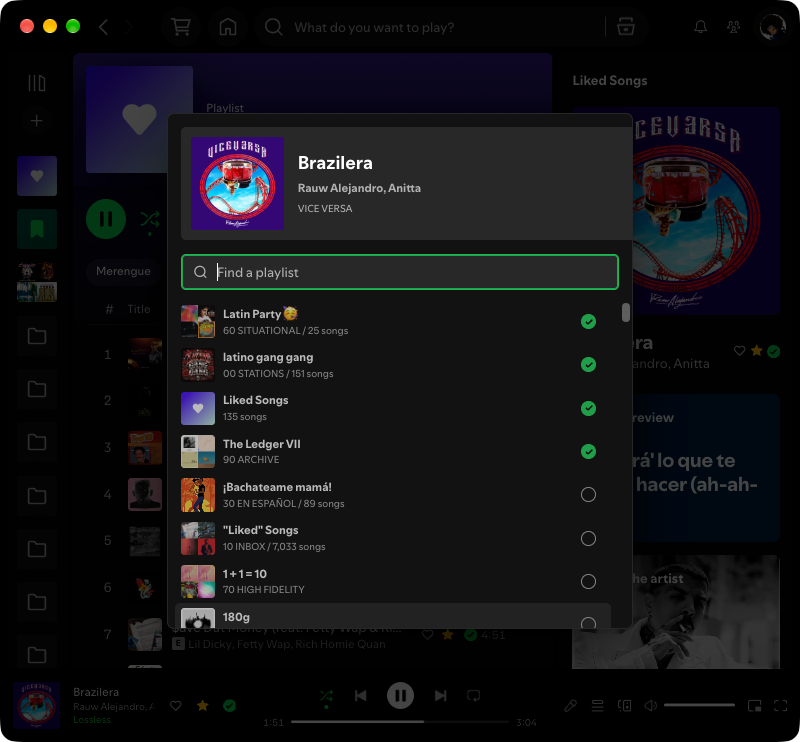

# Spicetify Enhancements

| Enhancement               | Description                                                                                                                                                                                                                                                                                                                                                                                                                                                                                                                                                                              |
| ------------------------- | ---------------------------------------------------------------------------------------------------------------------------------------------------------------------------------------------------------------------------------------------------------------------------------------------------------------------------------------------------------------------------------------------------------------------------------------------------------------------------------------------------------------------------------------------------------------------------------------- |
| [`Add`](add.js)           | Playlist picker and native + menu for adding or removing tracks and albums.                                                                                                                                                                                                                                                                                                                                                                                                                                                    |
| [`Like`](like.js)         | Star toggle for Liked Songs; press **⌘⇧L** (**Ctrl+Shift+L** elsewhere) to toggle the playing track.                                                                                                                                                                                                                                                                                                                                                                                                                                                                                     |
| [`Love`](love.js)         | Heart toggle for a Loved Songs playlist (created on demand); loving a track also likes it. Press **⌘⌥⇧L** (**Ctrl+Alt+Shift+L** elsewhere) to toggle the playing track.                                                                                                                                                                                                                                                                                                                                                                                                                  |
| [`Lyrics`](lyrics.js)     | Movable, resizable live lyrics window; press **⌘⌥L** in Spotify (**Ctrl+Alt+L** elsewhere). The shortcut toggles the panel; **Esc** closes it while focused. Select lyric text to copy. Right-click in the lyrics area to sync. **Alt+/−** changes only lyric text size; **Alt+0** resets it. On macOS **Ctrl+/−/0** also works. Spotify intercepts **⌘+/−** on macOS and zooms its main window, so use the panel shortcuts instead. **S** resumes following. PiP remains always on top because Spotify exposes no toggle.  |
| [`Play`](play.js)         | Starts (`spotifix play`) a random source in sequential, shuffle, or smart shuffle mode.                                                                                                                                                                                                                                                                                                                                                                                                                                                                                                  |
| [`Settings`](settings.js) | Applies consistent playback, audio quality, crossfade, volume, zoom, and compact-view preferences.                                                                                                                                                                                                                                                                                                                                                                                                                                                                                       |
